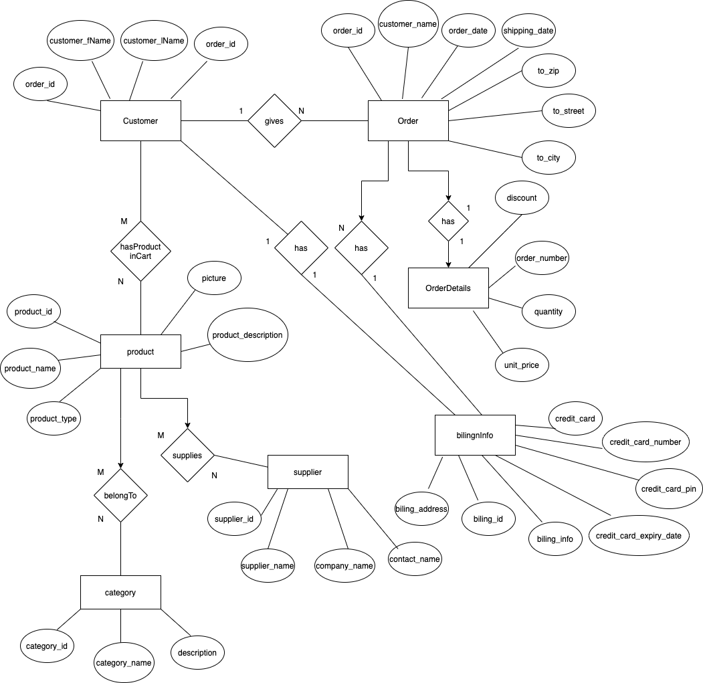

# ER-Diagram-Sql-Queries

## Description: 

1. Database Name: Market
2. List of Entities
  a. Customer
  b. Orders
  c. OrderDetails
  d. Product
  e. Category
  f. Suppllier
  g. BillingInfo

## Tables Entries 
- Customer table: This is entity describes the Customer who wants to place an order, it has the
following attributes:
  - order_id (primary key)
  - customer_id (primary key)
  - customer_name
  - customer_city
  - customer_country

- Orders Table: This entity describes the order that has been placed by the cutomer, it has the
follwing attributes:
  - order_id
  - customer_name
  - order_date
  - shipping_date
  - to_zip
  - to_street
  - to_city

- Order Details: This entity describes the order details of the bought product, it has the following attributes
  - Discount
  - order_number
  - quantity
  - unit_price
  
- Product: This entity describes the product that has been pucrchased by the cutomer, it has the
follwing attributes
  - product_id (primary key)
  - product_name
  - product_type
  - product_picture
  - product_description

- Category: This entity describes the category that the product belongs to, it has the follwing
attributes
  - category_id(primary key)
  - category_name
  - category_description

- supplier: This entity describes the supplier that provides the product, it has the following
attributes
  - supplier_id(primary key)
  - supplier_name
  - company_name
  - contact_name

- BillingInfo: This entity describes the billing info of the user, it has the following attributes
  - Billing_address
  - Billing_id(primary_key)
  - Billing_info
  - credit_card_expiry_date
  - credit_card_pin
  - credit_card_number
  - credit_card_name

  ## ER-Diagram 
  

